

# Image Augzoo

Image Augmentation Zoo

## original

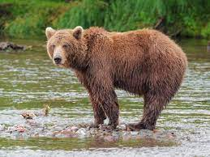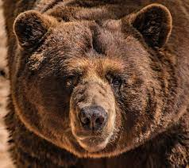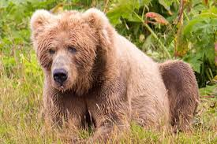

## cutmix

### cutmix_batch

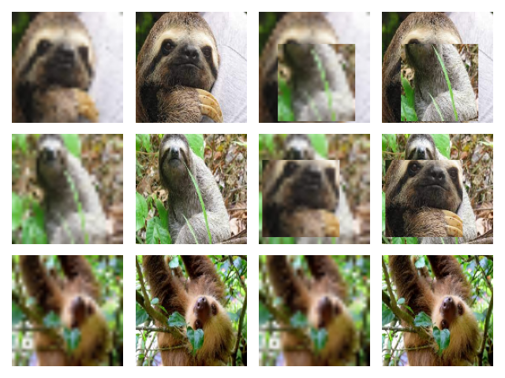

### cutmix_single_sr

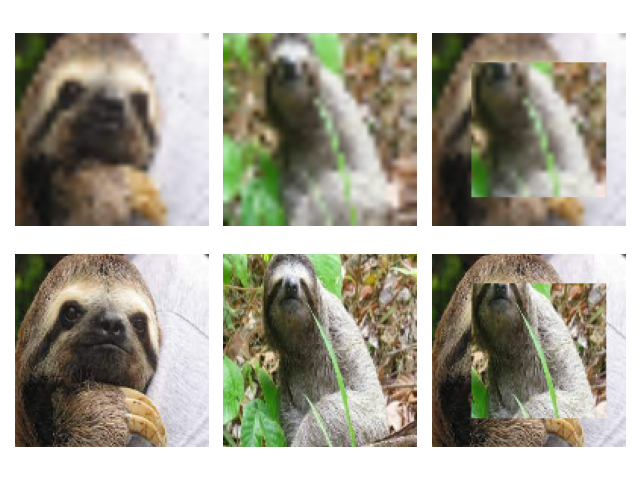

### cutmix_single

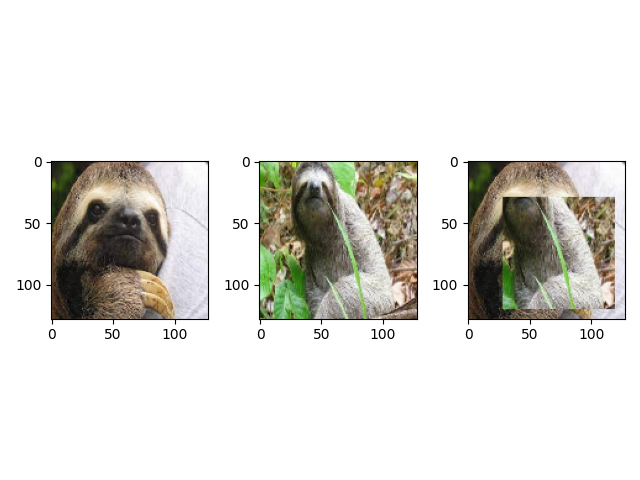

### cutmix_batch_v2

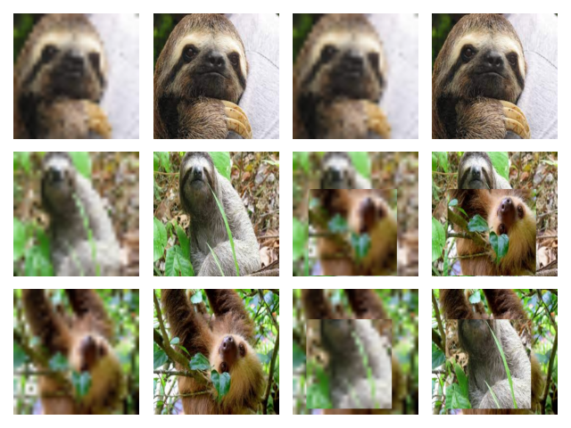

### cutmix_batch_p

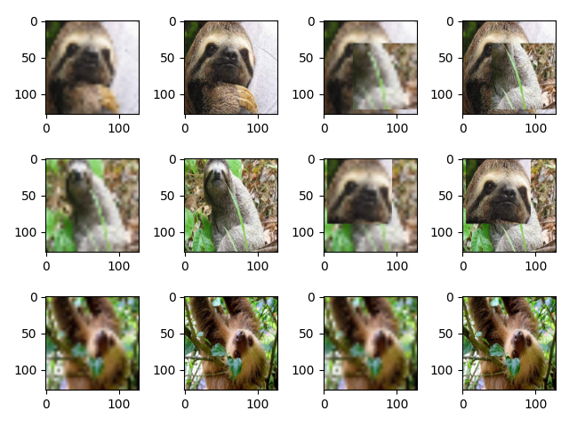

## cutblur

### cutblur_batch

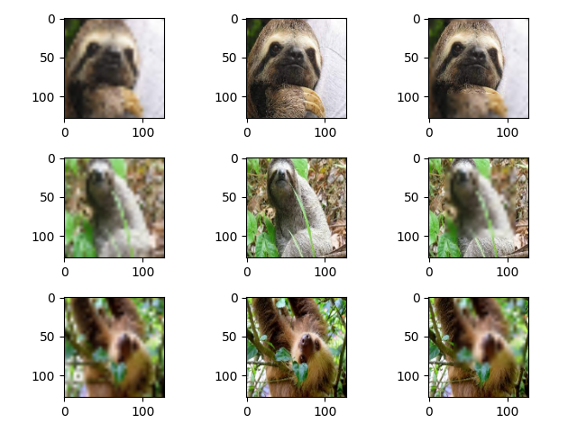

### cutblur_batch_p

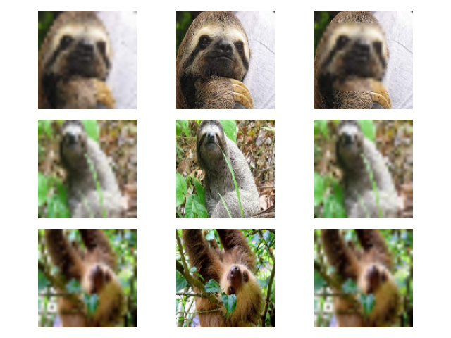

### cutblur_single

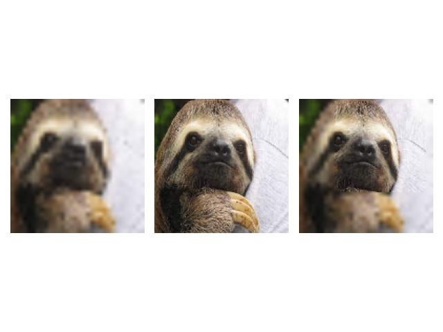

## blend

### blend_single

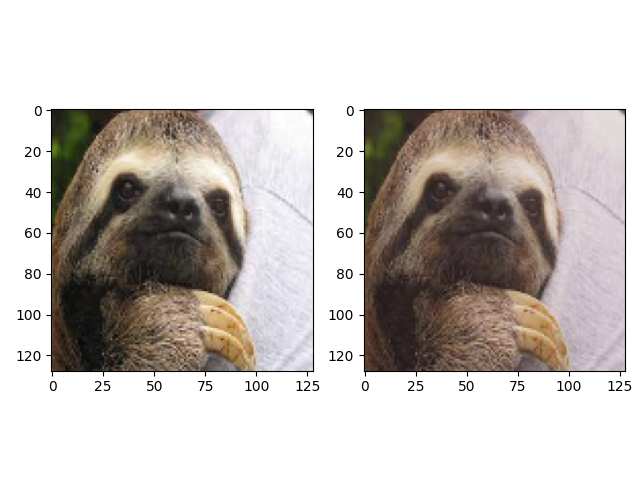

### blend_batch_v2

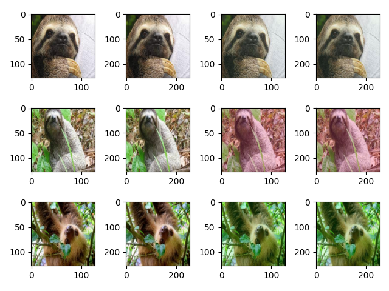

### blend_batch_uint

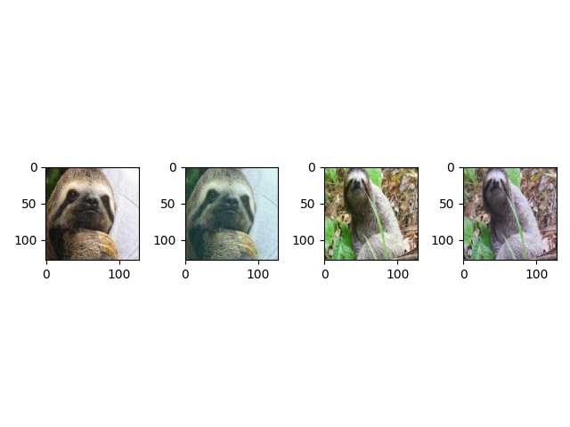

### blend_batch

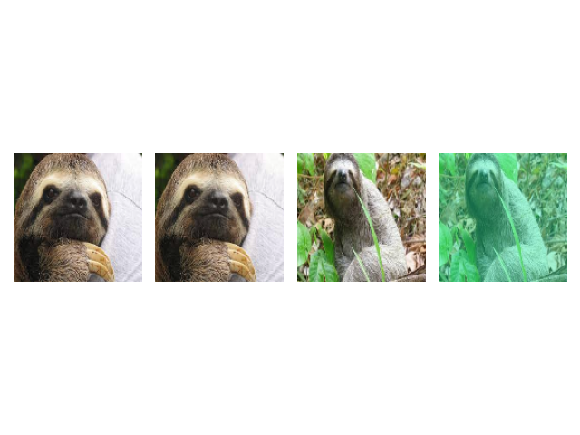

### blend_batch_p

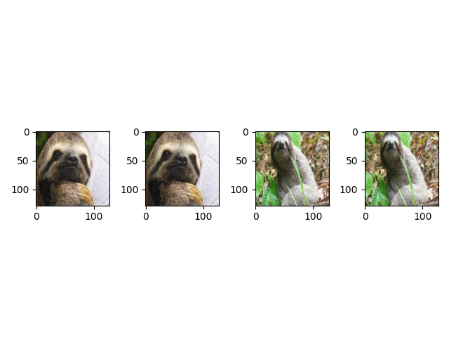

## cutout

### cutout_single_sr

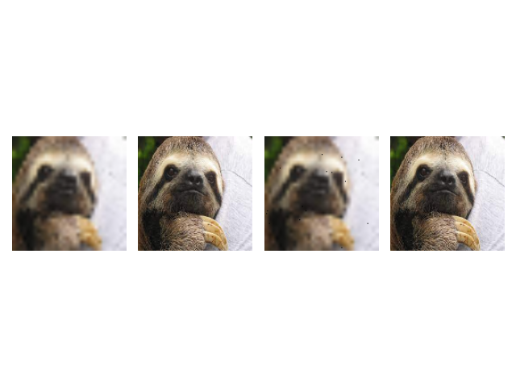

### cutout_single

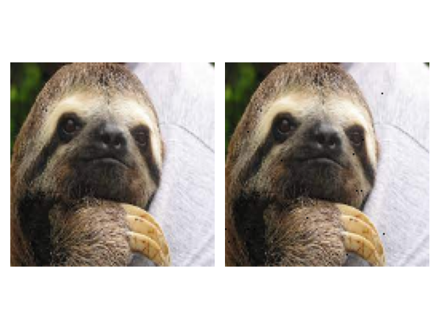

### cutout_batch

### cutout_batch_p

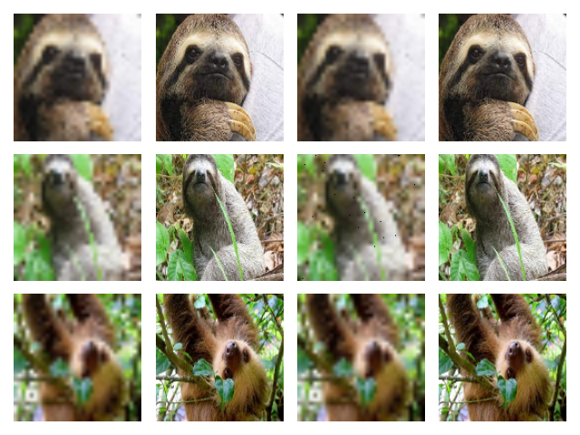

